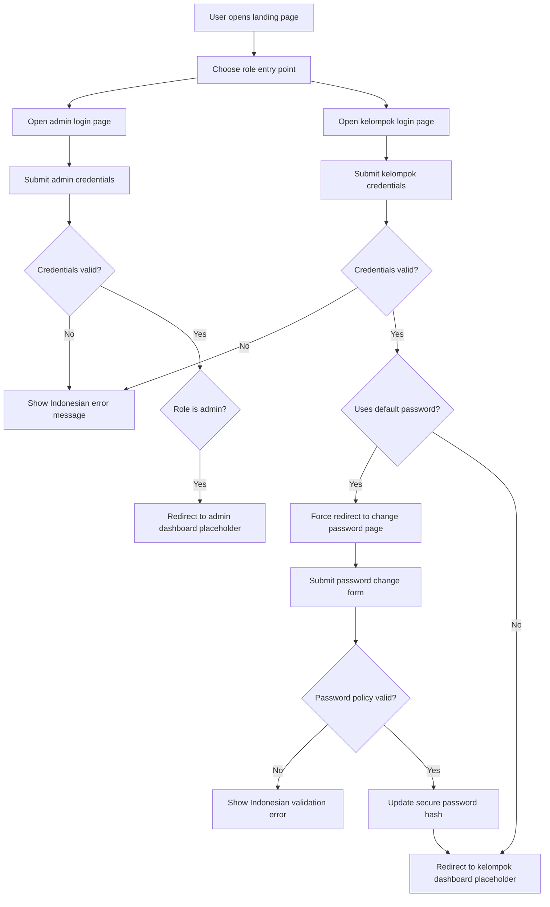

## 1. Product Overview
Taaruf Management System (TMS) is an internal web application for SMKN 1 Cimahi to organize the annual Taaruf event through structured group and admin access.
- This Phase 1 scope establishes the production-ready application foundation, authentication flows, layout system, reusable UI components, and database/auth preparation for future feature expansion.
- The product value is long-term maintainability: future phases can add operational event features without rebuilding the platform architecture.

## 2. Core Features

### 2.1 User Roles
| Role | Registration Method | Core Permissions |
|------|---------------------|------------------|
| Admin | Pre-created internal account | Access admin login, authenticated admin layout, admin dashboard placeholder, account management foundation |
| Kelompok | Pre-created imported account in future phases | Access kelompok login, forced password change on first login, authenticated kelompok layout, kelompok dashboard placeholder |

### 2.2 Feature Module
1. **Landing page**: branded hero section, role entry points, countdown placeholder, announcement placeholder, footer
2. **Admin login page**: separate authentication form for internal admin access
3. **Kelompok login page**: separate authentication form with username, password, show/hide password, remember-me option, Indonesian validation messages
4. **Change password page**: required first-login flow for accounts still using the default password
5. **Forgot password information page**: non-email recovery guidance directing users to admin support
6. **Admin dashboard placeholder**: protected layout shell with sidebar, navbar, user menu, notification placeholder, theme toggle
7. **Kelompok dashboard placeholder**: protected layout shell with sidebar, navbar, user menu, notification placeholder, theme toggle
8. **System status pages**: loading, 404, unauthorized, and forbidden experiences

### 2.3 Page Details
| Page Name | Module Name | Feature description |
|-----------|-------------|---------------------|
| Landing page | Hero section | Premium introduction with title, short description, action buttons for `Masuk Kelompok` and `Masuk Admin`, modern visual hierarchy |
| Landing page | Countdown placeholder | Static premium card reserved for future event countdown implementation |
| Landing page | Announcement placeholder | Static announcement block reserved for future admin-managed notices |
| Admin login | Authentication form | Username and password fields, Indonesian validation, loading state, authentication error handling |
| Kelompok login | Authentication form | Username and password fields, show/hide password control, remember-me checkbox, Indonesian validation, secure login submission |
| Change password | Forced security flow | Old password, new password, confirmation, minimum length, no default-password reuse, success redirect to dashboard placeholder |
| Forgot password | Help content | Explains that password resets are handled only by admin and that email recovery is not supported |
| Admin dashboard | Layout shell | Sidebar, top navbar, breadcrumb placeholder, notification placeholder, theme switch, user menu, empty dashboard content area |
| Kelompok dashboard | Layout shell | Sidebar, top navbar, breadcrumb placeholder, notification placeholder, theme switch, user menu, empty dashboard content area |
| Error pages | Access states | Clear and branded messaging for not found, unauthorized, and forbidden access |
| Shared components | Design system | Reusable buttons, inputs, cards, dialogs, loading states, navigation primitives, avatars, containers, and page headers |

## 3. Core Process
Primary flows focus on secure entry into the system, role-based routing, and first-login enforcement for default credentials.

## 4. User Interface Design
### 4.1 Design Style
- Direction: premium modern product UI inspired by Apple, Linear, and Notion, tailored for an internal school operations system
- Color system: neutral base with elegant surface layering, cool dark tones for dark mode, muted blue accent for actions, warm subtle highlights for status surfaces
- Button style: rounded large-radius controls with soft shadows, subtle glass surfaces, animated hover depth, and accessible contrast
- Typography: refined sans-serif pairing with strong hierarchy, clean spacing, readable body copy, Indonesian UI labels
- Layout style: responsive app shell with sidebar + top navbar for authenticated areas, card-based content organization, mobile-first scaling
- Motion: restrained Framer Motion transitions, fade and slide reveals, smooth theme transitions, polished focus states
- Icon style: Lucide icons with thin-stroke premium aesthetic

### 4.2 Page Design Overview
| Page Name | Module Name | UI Elements |
|-----------|-------------|-------------|
| Landing page | Hero section | Full-width premium hero, layered gradient/glass background, strong headline, supporting copy, dual CTA buttons, subtle animation |
| Landing page | Secondary content | Two polished placeholder cards for countdown and announcements, responsive grid, soft shadows |
| Login pages | Form card | Centered authentication panel, premium card surface, role-specific heading, supportive descriptions, clear labels in Bahasa Indonesia |
| Change password | Security card | Focused security-first layout with step clarity, password rules, inline validation feedback |
| Dashboard placeholders | App shell | Persistent sidebar, compact top navbar, user menu, theme switch, notification button, responsive content container |
| Error pages | Empty state composition | Large typography, icon illustration, explanatory text, role-aware action buttons |

### 4.3 Responsiveness
- Mobile-first implementation with compact stacked navigation on small screens
- Tablet optimization for dashboard shell, card grids, and authentication forms
- Desktop refinement with expanded spacing, richer glass surfaces, and sidebar-first navigation
- Touch-friendly controls, keyboard accessibility, and focus-visible support across all interactive elements

## 5. Non-Goals For Phase 1
- Reservation or room allocation logic
- Taaruf progress tracking workflows
- WhatsApp message generation
- Statistics, analytics, charts, or operational dashboards
- Group import tools, reset-password admin actions, and data management screens beyond authentication foundation
- Countdown logic, announcement CMS logic, and live notifications
- Final business modules beyond placeholder surfaces and architectural preparation
