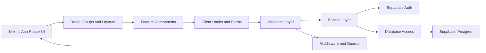
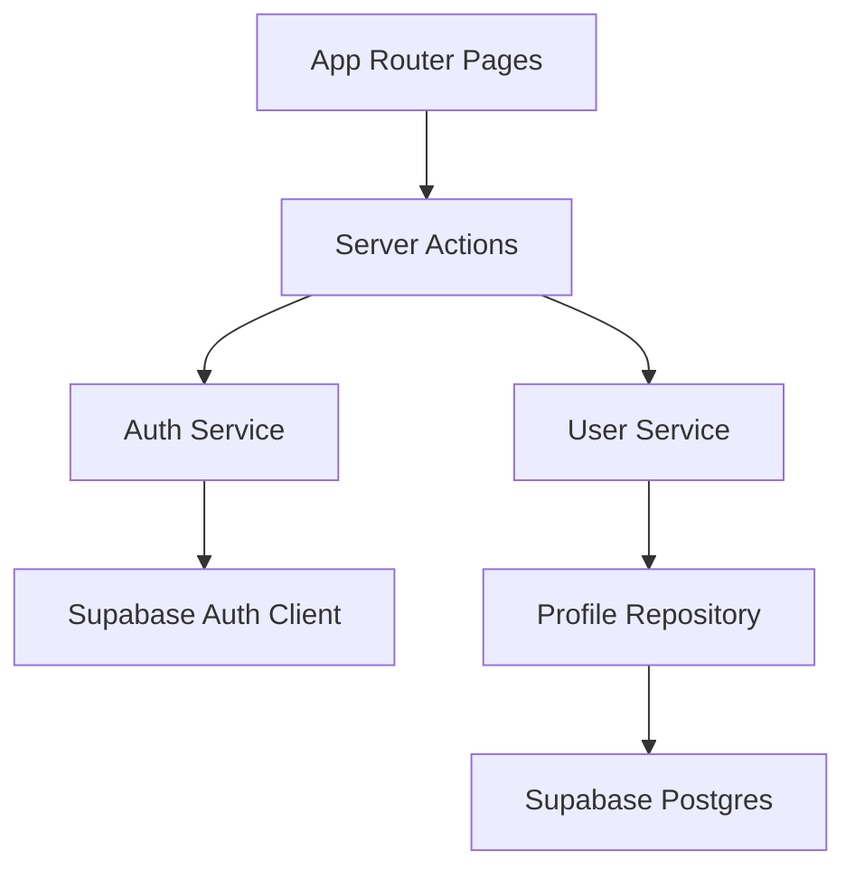
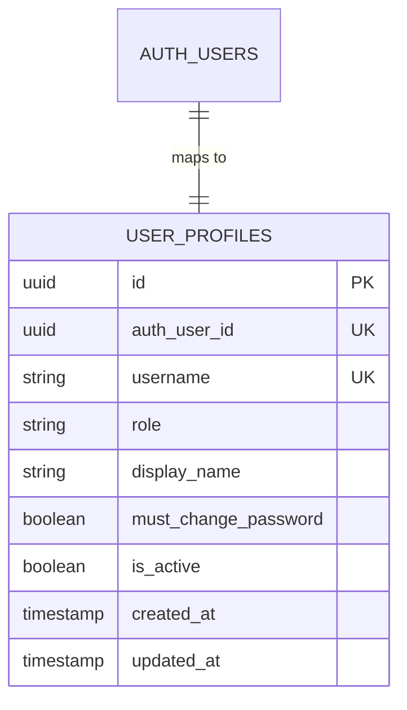

## 1. Architecture Design


## 2. Technology Description
- Frontend framework: Next.js 15 with App Router and React 19-compatible patterns
- Language: TypeScript with strict mode enabled
- Styling: Tailwind CSS with theme tokens and utility-first composition
- UI system: shadcn/ui primitives customized for TMS brand direction
- Forms: React Hook Form + Zod resolver
- Animation: Framer Motion for premium transitions and micro-interactions
- Icons: Lucide React
- Backend foundation: Supabase for authentication and PostgreSQL
- ORM strategy: Prisma marked as optional and deferred unless future data modules require a repository abstraction beyond Supabase access
- Authentication: Supabase Auth + custom profile/role metadata + password status enforcement
- Deployment target: Vercel or equivalent Node-compatible platform

## 3. Route Definitions
| Route | Purpose |
|-------|---------|
| `/` | Landing page with role entry points, countdown placeholder, and announcement placeholder |
| `/admin/login` | Separate admin authentication page |
| `/kelompok/login` | Separate kelompok authentication page |
| `/ganti-password` | Forced password update page for first-login or default-password users |
| `/lupa-password` | Informational page stating password reset is handled by admin |
| `/admin/dashboard` | Protected admin dashboard placeholder |
| `/kelompok/dashboard` | Protected kelompok dashboard placeholder |
| `/unauthorized` | Page shown when the user is unauthenticated |
| `/forbidden` | Page shown when the user lacks the required role |
| `not-found` | Global 404 experience |

## 4. API Definitions
Phase 1 prioritizes server actions and service abstractions over public REST endpoints. Internal action contracts remain explicitly typed.

```ts
export type UserRole = "admin" | "kelompok";

export interface AuthUser {
  id: string;
  username: string;
  role: UserRole;
  mustChangePassword: boolean;
  displayName: string | null;
}

export interface LoginInput {
  username: string;
  password: string;
  rememberMe?: boolean;
}

export interface LoginResult {
  success: boolean;
  role?: UserRole;
  redirectTo?: string;
  message?: string;
}

export interface ChangePasswordInput {
  currentPassword: string;
  newPassword: string;
  confirmPassword: string;
}

export interface ChangePasswordResult {
  success: boolean;
  redirectTo?: string;
  message?: string;
}
```

## 5. Server Architecture Diagram


## 6. Data Model
### 6.1 Data Model Definition
Phase 1 prepares a minimal schema to support role-based authentication, forced password change, and future operational extensions.



### 6.2 Data Definition Language
```sql
create table if not exists public.user_profiles (
    id uuid primary key default gen_random_uuid(),
    auth_user_id uuid not null unique,
    username text not null unique,
    role text not null check (role in ('admin', 'kelompok')),
    display_name text,
    must_change_password boolean not null default true,
    is_active boolean not null default true,
    created_at timestamptz not null default now(),
    updated_at timestamptz not null default now()
);

create index if not exists idx_user_profiles_role on public.user_profiles(role);
create index if not exists idx_user_profiles_active on public.user_profiles(is_active);
```

## 7. Proposed Folder Structure
| Path | Responsibility |
|------|----------------|
| `app/` | Route segments, layouts, loading states, error pages, and page composition |
| `components/` | Reusable UI, layout, navigation, feedback, and feature components |
| `hooks/` | Reusable client hooks such as theme, auth helpers, and media queries |
| `services/` | Business-facing services for auth and future domain modules |
| `lib/` | Shared clients, config, constants, auth utilities, Supabase helpers |
| `types/` | Shared TypeScript types and domain models |
| `utils/` | Generic helpers and formatting utilities |
| `database/` | SQL, schema notes, seed preparation, and migration-ready assets |
| `validation/` | Zod schemas for forms and server actions |
| `middleware/` | Route guard helpers and access-control logic used by Next middleware |

## 8. Authentication and Access Strategy
- Maintain two explicit entry points: `/admin/login` and `/kelompok/login`
- Store canonical account role and `must_change_password` status in `user_profiles`
- Reject users whose role does not match the route they are trying to access
- Use middleware to enforce:
  - unauthenticated users -> redirect to the correct login page or `/unauthorized`
  - authenticated users with wrong role -> redirect to `/forbidden`
  - authenticated `kelompok` users with `must_change_password = true` -> redirect to `/ganti-password`
  - authenticated users visiting login pages -> redirect to their dashboard or password-change route
- Use secure password handling through Supabase Auth and server-only action boundaries

## 9. Environment Variables
| Variable | Purpose |
|----------|---------|
| `NEXT_PUBLIC_SUPABASE_URL` | Supabase project URL |
| `NEXT_PUBLIC_SUPABASE_ANON_KEY` | Supabase public anonymous key |
| `SUPABASE_SERVICE_ROLE_KEY` | Server-only administrative Supabase access |
| `DATABASE_URL` | Direct database connection string for optional Prisma or SQL workflows |
| `NEXT_PUBLIC_APP_URL` | Canonical app URL for redirects and metadata |
| `JWT_SECRET` | Custom JWT secret for any additional token utilities if needed |

## 10. Phase 1 Deliberate Exclusions
- Reservation management schema
- Event progress-tracking domain tables
- WhatsApp generation services
- Analytics aggregations and statistics endpoints
- Admin operational tools beyond authentication foundation
- Group import pipeline, reset-password action, and dashboard business widgets
